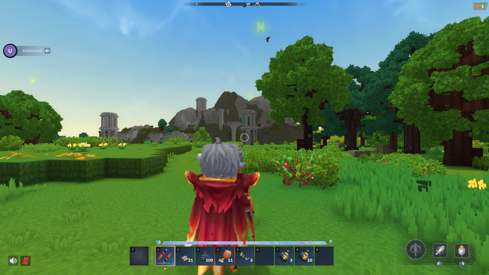

# Resonance — Hytale Proximity Audio Mod

A proof-of-concept audio streaming system for Hytale servers that leverages the proximity chat system to play audio sounds without requiring asset packs. Perfect for lobby ambiance, NPC dialogues, quest narration, spatial effects, and dynamic soundscapes.

## Features

🎵 **Stream audio directly to players** - No asset pack dependencies required  
🌍 **Global and spatial audio** - Broadcast to all players or position sounds in the world  
📍 **Distance-based attenuation** - Spatial sounds fade naturally up to 32 blocks away  
🎛️ **Dynamic content control** - Pause, resume, adjust volume, and manage audiences in real-time  
🔄 **Flexible audio sources** - Support for local files, remote URLs, and classpath resources  
🎚️ **Simple API** - Intuitive methods for creating and managing audio sessions  
⚡ **Real-time encoding** - Opus codec at 48 kHz with 20ms frames (64 kbps)

## Quick Start

### 1. Get the Manager

```java
IResonanceManager manager = ResonanceProvider.get();
```

### 2. Create Global Audio (same volume for all players)

```java
IAudioSession session = manager.create(
    "lobby_music",
    IAudio.of("/music/ambient.mp3"),
    0.3f,   // Volume [0.0, 1.0]
    true    // Loop
);

// Add player to hear it
session.addAudience(player);
```

### 3. Create Spatial Audio (positioned with distance attenuation)

```java
Transform soundPos = new Transform(new Vector3d(100, 64, 200), ...);

IAudioSession spatialAudio = manager.create(
    "explosion",
    IAudio.fromUrl("https://cdn.example.com/explosion.wav"),
    world,
    soundPos,
    1.0f,
    false
);

// Players near the position automatically hear it attenuated by distance
```

### 4. Control Playback

```java
session.setVolume(0.5f);           // Adjust volume
session.pause(true);                // Pause
session.setLooping(false);          // Disable looping
session.addAudience(newPlayer);     // Add listener
session.removeAudience(oldPlayer);  // Remove listener
session.stop();                     // Stop permanently
```

---

## Audio Sources

Three ways to load audio:

**Local File**
```java
IAudio audio = IAudio.of(Paths.get("sounds/effect.wav"));  // Supports: WAV, MP3, OGG
```

**Remote URL**
```java
IAudio audio = IAudio.fromUrl("https://example.com/sound.wav");  // Auto-cached
```

---

## How It Works

Resonance operates by integrating with Hytale's proximity chat system:

1. **Session Creation** - You create an audio session (global or spatial) with an ID
2. **Audio Decoding** - The system automatically detects audio format (WAV, MP3, OGG) and decodes it
3. **Encoding** - Every 20ms, audio frames are encoded using the Opus codec (48 kHz, mono, 64 kbps)
4. **Audience Management** - Players are added/removed from session audiences dynamically
5. **Network Transmission** - Encoded audio packets are sent to players via Hytale's voice channel
6. **Client Rendering** - Players receive and decode the Opus packets into audio

For **spatial audio**, the system additionally:
- Checks if the player is in the same world as the audio source
- Calculates distance from player to audio position
- Filters out players beyond 32 blocks away
- The client naturally attenuates the sound based on distance

---

## Demo

[](https://youtu.be/HUVEapgvgFU)

---

## License

This project is licensed under the terms specified in the repository.
